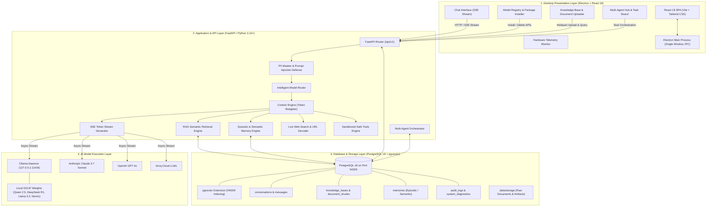
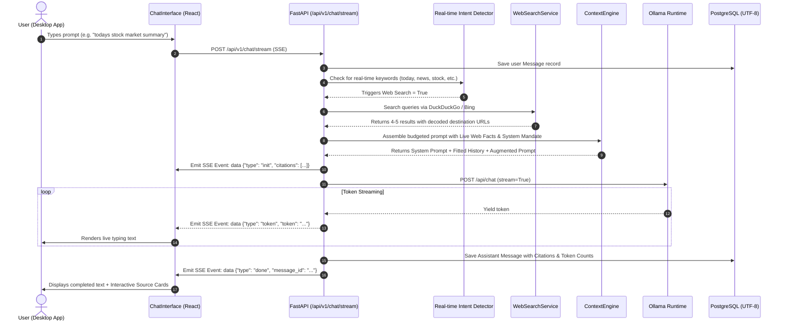
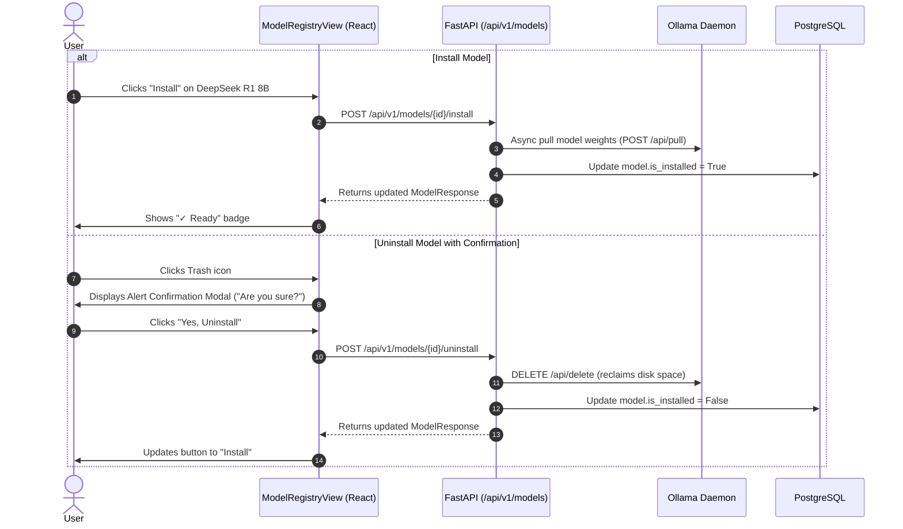

# Aetherius AI — System Architecture Document

## 1. High-Level Architecture Overview

Aetherius AI is structured as a decoupled multi-layer system comprising an Electron desktop client, a high-performance asynchronous FastAPI backend, a dedicated PostgreSQL 18 cluster with `pgvector`, a local Ollama model runtime, and optional cloud foundation model providers.

---

## 2. Layer-by-Layer Architecture

### 2.1. Presentation Layer (Desktop App)
* **Technology Stack**: Electron 31+, React 18, TypeScript, Tailwind CSS 3, Vite 5, Lucide React icons.
* **Electron Window Configuration**:
  - `autoHideMenuBar: true` and `win.removeMenu()` on Windows/Linux to eliminate the native ~30px menu bar and maximize usable viewport.
  - Native preload bridge (`preload.ts`) with `contextIsolation: true` and `nodeIntegration: false` for strict sandbox security.
* **Component Hierarchy**:
  - `App.tsx`: Central state coordinator (Active workspace, Hardware profile, Model lists, Onboarding lifecycle).
  - `ChatInterface.tsx`: Real-time SSE chat streaming, conversation drawer, search history, interactive source cards, model selector, RAG toggle, and Web Search toggle.
  - `ModelRegistryView.tsx`: Hardware telemetry display, model cards with compatibility badges, one-click install, and deletion confirmation modal dialog.
  - `RecommendedAI.tsx`: Hardware-tailored individual models and curated multi-model package batch installer with live checkmarks.
  - `KnowledgeView.tsx`: Drag-and-drop document uploader, chunk preview, similarity search inspector, and collection partitioner.
  - `AgentHubView.tsx`: Multi-agent dashboard with task step execution visualization.

---

### 2.2. Application & API Layer (FastAPI Backend)
* **Technology Stack**: FastAPI, Uvicorn, SQLAlchemy 2.0 Async, Pydantic v2, HTTPX, DuckDuckGo Search / DDGS, BeautifulSoup4.
* **Core Services**:
  1. **`ChatService`**: Orchestrates the 14-step chat lifecycle, including conversation resolution, memory extraction, tool invocation, RAG retrieval, web search, token budgeting, streaming generation, and PostgreSQL persistence.
  2. **`ContextEngine`**: Token budgeter ensuring prompt payloads (`system_prompt` + `fit_history` + `rag_chunks` + `web_results` + `user_prompt`) strictly fit inside the model's context window.
  3. **`ModelRouter`**: Hybrid heuristic + embedding classifier selecting the optimal model based on prompt complexity, task domain, latency constraints, and privacy level.
  4. **`RAGService`**: Ingests documents, splits text using recursive character chunking (500 tokens / 50 overlap), computes vector embeddings, and executes cosine similarity queries.
  5. **`MemoryService`**: Asynchronously extracts long-term facts and user preferences from conversation turns and saves them into the `memories` table with vector embeddings.
  6. **`WebSearchService`**: Executes live search queries, decodes target URLs from redirect links, extracts clean text snippets, and formats reference citations.
  7. **`ToolExecutionEngine`**: Deterministically evaluates expressions via AST parsing and executes SHA256 hashing, JSON formatting, and interest calculations.
  8. **`AgentOrchestrator`**: Coordinates multi-agent tasks, decomposes goals into sub-tasks, assigns tools, and tracks lifecycle states (`pending`, `running`, `completed`, `failed`).

---

### 2.3. Data & Storage Layer (PostgreSQL 18 + `pgvector`)
* **Dedicated Cluster Port**: `127.0.0.1:54329`
* **Encoding & Collation**: `UTF8` with `LC_COLLATE 'C'` and `LC_CTYPE 'C'`.
* **Database Schema Entities**:
  - `workspaces`: Multi-tenant workspace configurations (instructions, preferred model, tools, color, icon).
  - `conversations`: Chat sessions tied to specific workspaces with title, pinned state, and model history.
  - `messages`: User and assistant turns, token counts, model names, JSON extra metadata, and JSON source citations.
  - `knowledge_bases`: Named collections of documents belonging to workspaces.
  - `documents`: File records, MIME types, file sizes, processing statuses, and file hashes.
  - `document_chunks`: Text chunks with 768-dim `pgvector` embedding columns and chunk metadata (page number, token count).
  - `memories`: Long-term episodic, semantic, and preference memories with `pgvector` embedding columns.
  - `model_registry`: Registered AI models, parameters, quantization, hardware requirements, and install flags.
  - `model_packages`: Curated bundles of models for specific roles (Developer, Student, Enterprise).
  - `agent_definitions`: Agent archetypes (Coder, Researcher, Analyst, Architect) with system prompts and allowed tools.
  - `agent_tasks`: Multi-step task executions with logs, input/output artifacts, and statuses.
  - `audit_logs`: Security and activity logs with event types, user IDs, and metadata.

---

### 2.4. Model Runtime Layer
* **Local Ollama Daemon**: Accessible at `http://127.0.0.1:11434`.
  - `/api/tags`: Dynamically lists installed model tags on disk.
  - `/api/pull`: Downloads GGUF model weights in the background.
  - `/api/delete`: Deletes GGUF weights to immediately reclaim physical storage.
  - `/api/chat`: Streams tokens over HTTP chunked transfer.
* **Target Model Aliasing & Auto-Resolution**:
  - If a user requests a model family (e.g. `qwen`, `deepseek`, `llama3`), `OllamaProvider.resolve_target_model` dynamically maps it to the closest installed local tag (`qwen2.5-coder:7b`, `deepseek-r1:8b`, `llama3.2:3b`).
* **Cloud Fallback Providers**:
  - Anthropic Claude 3.7 Sonnet (via Anthropic Async SDK).
  - OpenAI GPT-4o / GPT-4o-mini (via OpenAI Async Client).
  - Groq Llama 3.3 (via Groq Client).

---

## 3. Key End-to-End Sequence Workflows

### 3.1. Real-Time Chat Completion with Live Web Search & Citations

---

### 3.2. Model Installation & Deletion Workflow

