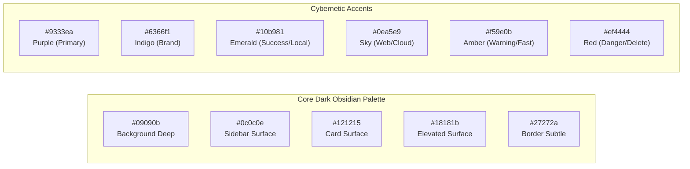
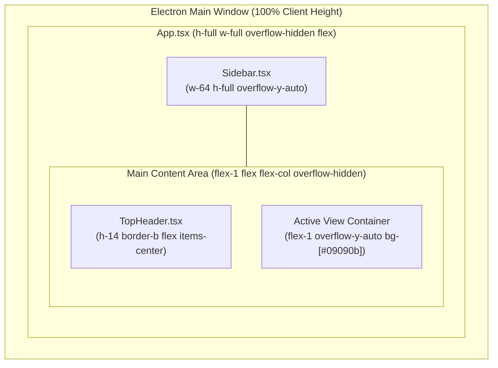

# Aetherius AI — Design System & UI/UX Specifications

## 1. Visual Philosophy & Design Identity

**Aetherius AI** embodies an **Obsidian Glass & Cybernetic Dark** aesthetic. It blends the minimalism of modern high-productivity development environments with cybernetic telemetry, ambient purple/indigo neon glows, and precise typography.

### Design Principles:
1. **Content First, Zero Clutter**: Chrome and framing fade into the background; code, documents, and real-time streaming text take center stage.
2. **Subtle Hardware Telemetry**: Live compute tier, RAM, VRAM, and `pgvector` database health indicators communicate local sovereign power without distraction.
3. **Deterministic Information Density**: High-information cards with compact typography, clean badges, and structured citations.
4. **Universal Text Usability**: Every word, code block, citation, and metric is selectable and copyable (`user-select: text`).

---

## 2. Color Palette & Design Tokens

### Tailwind Theme Color Tokens:
* **Background Deep**: `#09090b` (`bg-[#09090b]`)
* **Sidebar / Drawer**: `#0c0c0e` / `#0d0e12`
* **Card & Container Surface**: `#121215` (`border-zinc-800/80`)
* **Text Primary**: `#f4f4f5` (`text-zinc-100`)
* **Text Secondary / Metadata**: `#a1a1aa` (`text-zinc-400`)
* **Text Muted / Timestamps**: `#71717a` (`text-zinc-500`)
* **Brand Gradient**: `from-purple-600 to-indigo-500`

---

## 3. Typography System

| Role | Font Family | Size | Weight | Line Height | Usage |
| :--- | :--- | :--- | :--- | :--- | :--- |
| **Display Header** | Inter / System Sans | `1.875rem (30px)` | Bold (700) | `2.25rem` | Onboarding Titles, Main Headers |
| **Section Title** | Inter / System Sans | `1.125rem (18px)` | Semi-Bold (600) | `1.5rem` | View Headers, Dialog Titles |
| **Card Header** | Inter / System Sans | `0.875rem (14px)` | Semi-Bold (600) | `1.25rem` | Model Cards, Tool Cards |
| **Body Text** | Inter / System Sans | `0.875rem (14px)` | Regular (400) | `1.5rem` | Chat messages, Instructions |
| **Secondary / Meta** | Inter / System Sans | `0.75rem (12px)` | Medium (500) | `1rem` | Status indicators, Descriptions |
| **Code & Quantization** | JetBrains Mono / Fira | `0.6875rem (11px)`| Regular / Medium | `1rem` | Quantization, Tokens, RAM/VRAM |

---

## 4. Viewport & Layout Architecture

To ensure flawless rendering across both high-DPI desktop monitors and compact 13-inch laptop displays, Aetherius enforces a rigid viewport layout structure:

### Critical Layout Rules:
1. **No Window Overflow**: `html, body, #root` are locked to `height: 100%; overflow: hidden;`.
2. **Inner Scrollability**: Views (`ChatInterface`, `ModelRegistryView`, `RecommendedAI`, `KnowledgeView`) manage vertical scrolling internally with `overflow-y-auto` and bottom padding (`pb-20`).
3. **No Flex Centering Traps**: `my-auto` is prohibited inside scrollable multi-card lists to prevent top and bottom cards from escaping the viewport boundaries.

---

## 5. Key UI Component Specifications

### 5.1. Top Header (`TopHeader.tsx`)
* **Workspace Selector**: Pill dropdown showing active workspace color dot and name.
* **Database Health Indicator**: Live badge (`PostgreSQL: Connected` in green vs `PostgreSQL: Offline` in red).
* **Privacy Mode Pill**: `🛡️ LOCAL ONLY` (Emerald), `⚡ HYBRID` (Indigo), or `☁️ CLOUD` (Sky).
* **Hardware Compute Tier**: Displays `Ultra`, `High`, `Medium`, or `Low` with lightning bolt icon.
* **Theme & Window Controls**: Dark/Light mode toggle button.

### 5.2. Chat Interface (`ChatInterface.tsx`)
* **Sessions Drawer**: Searchable conversation history with active session highlights and hover-delete buttons.
* **Control Toolbar**:
  - Model Dropdown: Categorized by `⚡ Local (Installed)`, `📥 Local (Download)`, and `☁️ Cloud`.
  - Context & Quantization Pill: e.g. `Q4_K_M • 16k context`.
  - RAG Semantic Switch: Toggle with Collection selector.
  - Live Web Search Switch: Sky blue globe indicator.
  - Transcript Export: One-click export to Markdown (`.md`).
* **Message Thread**:
  - User Bubbles: Indigo background (`bg-indigo-600 text-white rounded-tr-sm`).
  - Assistant Bubbles: Obsidian surface (`bg-zinc-900/90 border border-zinc-800/80 rounded-tl-sm`).
  - Typing Indicator: 3-dot bouncing gradient dots during initial stream generation.
* **Source Citations Card Grid**:
  - Embedded directly below the assistant message.
  - Two-column responsive grid displaying source title, similarity score percentage, text snippet, and clickable external links.
* **Chat Input Bar**:
  - Multiline auto-expanding textarea with `Shift+Enter` for newlines and `Enter` to submit.
  - Floating send button and real-time status footer (`RAG Active`, `Web Active`).

### 5.3. Model Registry & Recommended AI (`ModelRegistryView.tsx` & `RecommendedAI.tsx`)
* **Hardware Telemetry Banner**: Live gauges for RAM utilization, VRAM, and compute tier recommendation.
* **Filter Pills**: `All`, `Recommended`, `Installed`, `Cloud`.
* **Model Cards**:
  - Category icon (`Coding`, `Reasoning`, `Fast`, `General`).
  - Compatibility Badge: `Compatible` (Green), `Maybe Compatible` (Amber), `Not Recommended` (Red).
  - Metrics Grid: Memory footprint (GB), Execution mode (GPU vs CPU), Performance tier.
  - Action Button: `Install` with download icon vs `✓ Ready` with checkmark.
  - One-Click Uninstall: Red hover trash button triggering the Alert Confirmation Modal.
* **Curated Packages Tab**:
  - Bundled model pills, estimated storage requirement, minimum RAM requirement, and batch "Install Package" button.

### 5.4. Confirmation Modal Dialog
* Rendered over an ambient black backdrop blur (`bg-black/75 backdrop-blur-sm`).
* Displays warning triangle icon, clear model name, confirmation warning (*"This will delete the model weights to free up disk space"*), and Cancel / "Yes, Uninstall" buttons.

---

## 6. Micro-Interactions & Animation Standards

* **Page & View Transitions**: Subtle fade-in duration `200ms` (`animate-in fade-in duration-200`).
* **Hover States**: Border highlights shifting from `border-zinc-800` to `border-zinc-700` with ease-out transition `duration-150`.
* **Status Pulses**: Active `pgvector` sync and live streaming indicators utilize subtle keyframe pulses (`animate-pulse`).
* **Copy Buttons**: Immediate visual feedback transforming copy icon into a green checkmark (`Check className="w-3 h-3 text-emerald-400"`) for 2,000ms.
