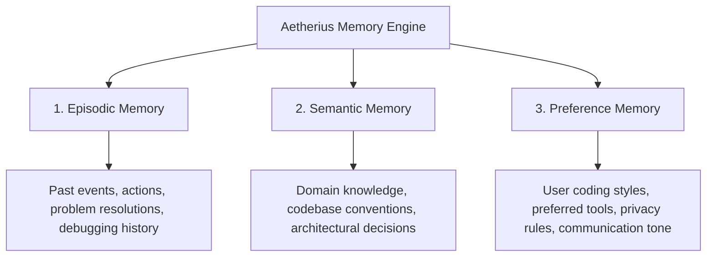
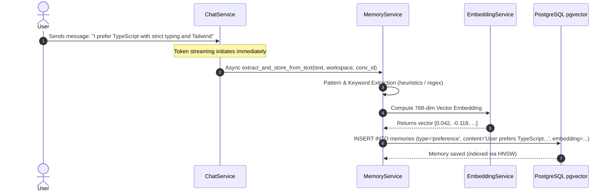
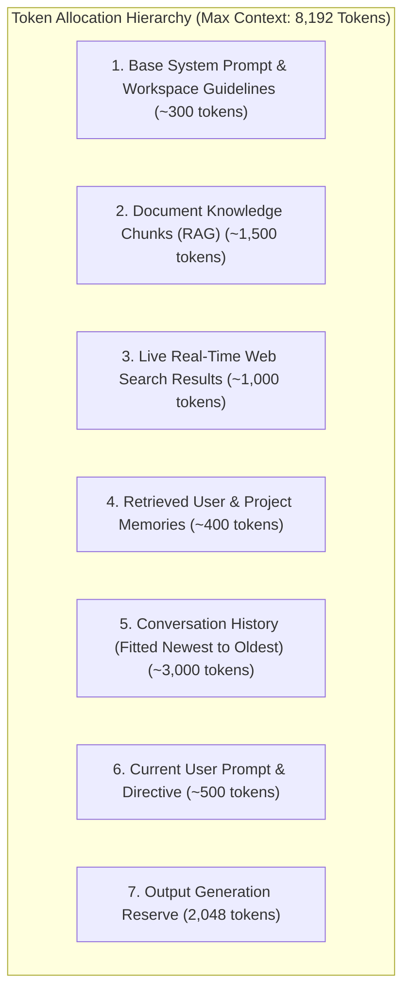

# Aetherius AI — Memory Engine & Context Architecture

## 1. Overview & Vision
Large Language Models lack native long-term memory across sessions. **Aetherius Memory Engine** provides a lifelong, private, hardware-accelerated memory architecture built on **PostgreSQL `pgvector`**. It continuously extracts user preferences, project context, key decisions, and historical episodes, transforming every interaction into durable intelligence while respecting strict privacy boundaries.

---

## 2. Memory Taxonomy & Classifications

Aetherius categorizes memories into three distinct types:



### Memory Schema Definition (`backend/app/models/memory.py`)
```python
class Memory(BaseModel):
    __tablename__ = "memories"

    id = Column(String, primary_key=True, default=generate_uuid)
    workspace_slug = Column(String, ForeignKey("workspaces.slug"), nullable=False, index=True)
    conversation_id = Column(String, ForeignKey("conversations.id"), nullable=True)
    memory_type = Column(String, nullable=False, default="semantic")  # episodic, semantic, preference
    content = Column(Text, nullable=False)
    importance_score = Column(Float, default=0.5)  # 0.0 to 1.0
    embedding = Column(Vector(768), nullable=True)  # pgvector embedding
    metadata = Column(JSON, default=dict)
    created_at = Column(DateTime(timezone=True), default=datetime.utcnow)
```

---

## 3. Autonomous Memory Extraction Lifecycle

During every chat turn, Aetherius triggers an asynchronous background extraction step without blocking the real-time token stream:



### Fact Extraction Heuristics:
1. **Preferences**: Phrases matching `"i prefer"`, `"i like"`, `"always use"`, `"my favorite"`, `"do not use"`.
2. **Project Facts**: Phrases matching `"our architecture"`, `"the database is"`, `"we use"`, `"the api endpoint is"`.
3. **Decisions & Milestones**: Phrases matching `"we decided to"`, `"the bug was caused by"`, `"resolved by"`.

---

## 4. Hybrid Retrieval & Semantic Matching

When a user submits a new prompt, `MemoryService.retrieve_relevant_memories` queries the PostgreSQL memory bank using cosine similarity combined with workspace scoping:

$$\text{Cosine Similarity} = 1 - (\mathbf{u} \cdot \mathbf{v})$$

### PostgreSQL `pgvector` Query Implementation:
```python
@staticmethod
async def retrieve_relevant_memories(
    db: AsyncSession,
    query: str,
    workspace_slug: str,
    top_k: int = 3,
    min_similarity: float = 0.1
) -> List[Tuple[Memory, float]]:
    # 1. Compute query vector
    query_vector = await EmbeddingService.get_embedding(query)

    # 2. Query pgvector cosine distance
    stmt = (
        select(
            Memory,
            (1 - Memory.embedding.cosine_distance(query_vector)).label("similarity")
        )
        .where(Memory.workspace_slug == workspace_slug)
        .order_by(Memory.embedding.cosine_distance(query_vector).asc())
        .limit(top_k)
    )
    result = await db.execute(stmt)
    records = result.all()

    # 3. Filter by similarity threshold
    return [(mem, score) for mem, score in records if score >= min_similarity]
```

---

## 5. Hierarchical Context Engine & Token Budgeting

The `ContextEngine` (`backend/app/services/context_engine.py`) prioritizes and fits the extracted memories into the prompt without exceeding the target model's context window:



### Memory Injection Format in System Prompt:
```text
User & Project Memory Context:
- [PREFERENCE] User prefers TypeScript strict typing and Tailwind CSS.
- [SEMANTIC] Database is PostgreSQL 18 running on port 54329 with UTF-8 encoding.
- [EPISODIC] Fixed Electron menu bar height overflow on Windows using autoHideMenuBar.
```

---

## 6. Memory Bank API Reference

| Endpoint | Method | Description | Payload / Query |
| :--- | :--- | :--- | :--- |
| `/api/v1/memory/` | `GET` | List all stored memories for a workspace | `?workspace_slug=general&memory_type=preference` |
| `/api/v1/memory/` | `POST` | Manually store a new memory item | `{"workspace_slug": "general", "memory_type": "semantic", "content": "..."}` |
| `/api/v1/memory/search` | `POST` | Execute hybrid vector search on memories | `{"query": "coding preferences", "workspace_slug": "general", "top_k": 5}` |
| `/api/v1/memory/{id}` | `DELETE` | Permanently delete a memory record | URL path parameter `id` |

---

## 7. Security & Workspace Partitioning

1. **Strict Multi-Tenant Isolation**: Memories created in workspace `finance` are strictly partitioned by `workspace_slug` and will never leak into workspace `developer` or `general`.
2. **PII Masking**: Personal identifiers (API keys, SSNs, credit card numbers) are redacted before vector embedding calculation to prevent vector leakage.
3. **User Deletion Authority**: Users maintain full sovereignty to view, edit, search, or purge any memory in the **Memory Bank** view in the desktop client.
