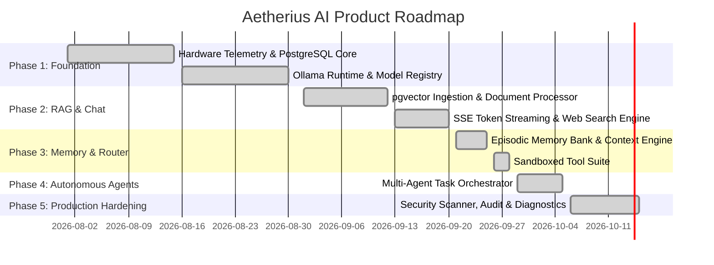

# Aetherius AI — Product Requirement Document (PRD)

## 1. Executive Summary & Vision
**Aetherius AI** is an enterprise-grade, privacy-first **AI Operating Environment (AI-OS)** designed for desktop workstations and secure enterprise nodes. It bridges the gap between raw local hardware execution (via Ollama / local GGUF runtimes) and high-context cloud foundation models (Anthropic Claude, OpenAI, Groq) within a unified, hardware-aware execution layer.

Aetherius eliminates the privacy risks of public AI platforms by providing zero-leakage local execution, automated hardware-based model recommendation, PostgreSQL `pgvector`-backed episodic and semantic memory, sandboxed workspace tools, live privacy-filtered web intelligence, and multi-agent autonomous task orchestration.

---

## 2. Core Value Propositions
1. **Privacy-Centric Architecture**: Strict local-first privacy modes (`LOCAL_ONLY`, `HYBRID`, `CLOUD`) with on-device sanitization of PII and automated prompt injection defense.
2. **Zero-Configuration Hardware Intelligence**: Instant telemetry detection of CPU cores, physical RAM, GPU VRAM, CUDA/DirectML acceleration, and storage speeds with automated model quantization recommendations.
3. **Enterprise PostgreSQL RAG & Memory**: Zero-SQLite architecture using PostgreSQL 18 with `pgvector` for semantic document retrieval and lifelong agent memory.
4. **Intelligent Dynamic Routing**: Sub-millisecond heuristic & embedding routing selecting the best model based on prompt complexity, task domain, latency constraints, and privacy level.
5. **Multi-Agent Task Orchestration**: Coordinated autonomous agents (Developer, Researcher, Analyst, Architect) executing asynchronous multi-turn workflows with human-in-the-loop approvals.
6. **Cross-Platform Responsive Desktop App**: Electron + React 18 + Tailwind CSS + TypeScript desktop client featuring token-by-token SSE streaming, generative UI widgets, and workspace partitioning.

---

## 3. User Personas & Target Segments

| Persona | Primary Goal | Key Features Leveraged |
| :--- | :--- | :--- |
| **Software Engineers & DevOps** | Local coding copilot, offline debugging, repo analysis | Coding agents, safe math & hash tools, local Qwen 2.5 Coder 7B/14B, DeepSeek R1 |
| **Enterprise / Financial Analysts** | Private data analysis, financial document RAG | PostgreSQL pgvector RAG, episodic memory, live DuckDuckGo web synthesis, audit logging |
| **Researchers & Students** | Literature review, PDF synthesis, factual reasoning | DeepSeek R1 reasoning, multi-document chunking, semantic memory bank, transcript export |
| **Privacy Officers & CISO** | Secure AI deployment, audit compliance, zero data egress | `LOCAL_ONLY` enforcement, PII redaction, prompt injection scanner, immutable audit logs |

---

## 4. Product Modules & Functional Requirements

### 4.1. Hardware Intelligence & Compatibility Engine
* **FR-1.1 (Telemetry Detection)**: Detect CPU model, cores, logical threads, RAM capacity, free RAM, GPU name, dedicated VRAM, CUDA compatibility, and storage metrics within 500ms on startup.
* **FR-1.2 (Hardware Tiering)**: Assign compute tiers: `Ultra` (>=24GB VRAM), `High` (>=12GB VRAM or 32GB RAM), `Medium` (>=6GB VRAM or 16GB RAM), `Low` (<6GB VRAM, 8-16GB RAM), `Minimum` (<8GB RAM).
* **FR-1.3 (Compatibility Matrix)**: Dynamically evaluate models against hardware specs, outputting memory footprint (GB), recommended execution target (GPU vs CPU Offload), and performance tier.
* **FR-1.4 (One-Click Local Runtime Lifecycle)**: Manage local Ollama models (`pull`, `delete`, tag synchronization) with confirmation dialogs to reclaim disk space.

### 4.2. Workspace Management & Partitioning
* **FR-2.1 (Multi-Tenancy Partitioning)**: Provide isolated workspaces (`General`, `Developer`, `Research`, `Finance`, `Executive`) with separate instructions, knowledge bases, episodic memories, and tool access permissions.
* **FR-2.2 (System & Custom Workspaces)**: Pre-seed standard system workspaces and allow creation of custom user-defined workspaces with custom icon, color, and system instructions.

### 4.3. Real-Time Chat & SSE Streaming
* **FR-3.1 (Token-by-Token SSE)**: Deliver real-time Server-Sent Events (`/api/v1/chat/stream`) token generation directly into the React client with ChatGPT-style live rendering.
* **FR-3.2 (Hierarchical Context Assembly)**: Assemble token-budgeted prompt payloads fitting system instructions, episodic memories, RAG document chunks, live web snippets, and conversation history within context windows.
* **FR-3.3 (Automatic Model Fallback & Resolution)**: Resolve requested model aliases to available installed local weights with graceful fallback.

### 4.4. Knowledge Base & PostgreSQL `pgvector` RAG
* **FR-4.1 (Multi-Format Document Ingestion)**: Ingest `.pdf`, `.docx`, `.txt`, `.md`, `.json`, `.csv`, `.py`, `.js`, `.ts` files with automated chunking (500 tokens with 50-token overlap).
* **FR-4.2 (Vector Embeddings)**: Generate 768-dimensional or 1536-dimensional embeddings with cosine similarity matching using `pgvector` index.
* **FR-4.3 (Source Citations & Deep Linking)**: Render interactive citations with filename, chunk similarity score, text snippet, and page number under assistant messages.

### 4.5. Semantic & Episodic Memory Bank
* **FR-5.1 (Autonomous Memory Extraction)**: Extract long-term facts, user preferences, project constraints, and episodic events asynchronously from chat turns.
* **FR-5.2 (Semantic Search & Retrieval)**: Query memories via hybrid keyword + vector similarity, injecting relevant facts into current conversation context.

### 4.6. Real-Time Web Intelligence & Citations
* **FR-5.1 (Live Search Engine)**: Query live internet data via DuckDuckGo / Bing endpoints with automatic redirect URL decoding and clean snippet extraction.
* **FR-5.2 (Auto-Intent Activation)**: Automatically activate web search when user queries contain time-sensitive triggers (e.g. *today, latest, news, stock market, sensex, nifty, weather*).
* **FR-5.3 (Terminal Reference Links)**: Mandate the synthesis of web facts into the response and output a structured `### Sources & References` section.

### 4.7. Workspace Tools Suite
* **FR-6.1 (Sandboxed Safe Tools)**: Built-in deterministic tools including Safe Math Expression Evaluator, Cryptographic SHA256 Hasher, JSON Formatter, and Compound Interest Calculator.
* **FR-6.2 (Automated Execution & Inline Citations)**: Parse tool invocation triggers (`calc:`, `hash:`, etc.) and append tool execution certificates to message metadata.

### 4.8. Autonomous Multi-Agent Orchestration
* **FR-7.1 (Agent Archetypes)**: Pre-configured specialized agents (`CoderAgent`, `ResearcherAgent`, `AnalystAgent`, `ArchitectAgent`) equipped with specific system prompts, tools, and execution models.
* **FR-7.2 (Multi-Step Task Execution)**: Asynchronous task creation, step decomposition, iterative execution, and final artifact generation.

### 4.9. Enterprise Security, Hardening & Diagnostics
* **FR-8.1 (PII Masking)**: Regex & NER redacting emails, phone numbers, SSNs, credit card numbers, and API tokens before prompt assembly.
* **FR-8.2 (Prompt Injection Defense)**: Inspect incoming messages for jailbreaks, system prompt override attempts, and unauthorized instruction tampering.
* **FR-8.3 (Audit Logging)**: Immutable PostgreSQL audit trails logging user activity, model routing, token usage, tool invocations, and security flags.
* **FR-8.4 (Export & Diagnostics)**: Export full session transcripts (Markdown, JSON, TXT) and run health checks across PostgreSQL, Ollama daemon, and memory usage.

---

## 5. Non-Functional Requirements (NFR)

* **Performance & Latency**:
  - Telemetry scan duration: `< 500ms`.
  - Context engine token budgeting assembly: `< 25ms`.
  - First-token streaming latency (local model): `< 400ms`.
  - First-token streaming latency (cloud model): `< 600ms`.
* **Reliability & Availability**:
  - Zero SQLite fallback. Fully resilient PostgreSQL 18 with async pooling.
  - Automatic reconnect on network interruptions.
* **Portability & Cross-Platform**:
  - Windows 10/11, macOS (Apple Silicon / Intel), Linux (Ubuntu 22.04+).
* **Security & Compliance**:
  - Client-side token storage in OS secure keychain / encrypted storage.
  - Database encoding strictly configured to `UTF-8` with `LC_COLLATE 'C'` for universal multilingual and emoji support.

---

## 6. Release Roadmap & Milestones

